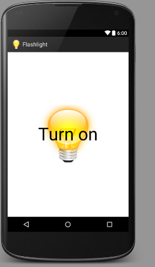

# Android-flashlight
Flashlight for android phones that uses camera light

Simple application to control the camera light and use it as a flashlight.
Application allows to turn the light on and off. The screen doesn't turn off and the app is always in horizontal view, so the application won't change it's state while the camera light is on.

